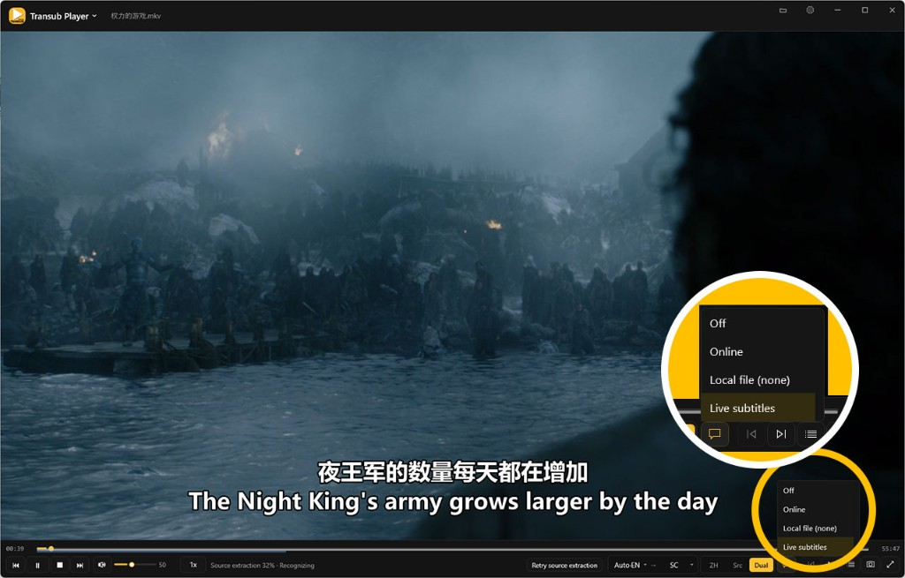

# Transub Player

[English](README.md) | [简体中文](README.zh-CN.md) | [日本語](README.ja.md) | [한국어](README.ko.md)

**動画を開けば、字幕が続いてきます。**

洋画、ドラマ、アニメ——字幕ファイルがなくても、まずは視聴できます。  
開くと映像がすぐ表示され、読みやすい字幕がすぐ後から追いつきます。字幕サイトを探し回らなくても、視聴を続けられます。

<p align="center">
  
</p>

> Windows 向けデスクトッププレーヤー · 現在のバージョン 1.5.2  
> [GitHub](https://github.com/dlsandy/Transub-Player/releases) または [GitCode](https://gitcode.com/AndyDai/Transub-Player/releases) からインストーラーまたはポータブル版をダウンロードしてください。アプリ内の「更新を確認」からもアップグレードできます。

---

## 選ばれる理由

**見ながら字幕が出る**  
内蔵の音声認識で字幕をリアルタイム生成。進捗が一目でわかり、止まっているのか動いているのか迷いません。

**訳文 · 原文 · 二言語をワンクリック**  
気軽に見るなら訳文、学習するなら二言語。翻訳がまだ準備できていなくても、原文字幕で再生は続き、視聴は中断しません。

**中 / 日 / 韓 / 英の相互翻訳**  
再生中にソース言語と訳出言語を切り替え可能。ファイル名からソース言語を推測することもできます。まずは「すぐわかる」を優先し、必要に応じて強化できます。  
今後さらに多くの言語に対応予定です。

**配信も再生、録画もできる**  
一般的なネットワーク配信 URL を直接再生。あとで見返したいときは、ワンクリックでローカルに録画できます。

**Transub 字幕ジェネレーターと深く連携**  
Transub で高品質字幕を生成すると、準備完了後にプレーヤーが再生を案内します。

---

## こんな方に

- すぐ外国語コンテンツを理解したいが、字幕サイトを探し回りたくない  
- 手元に字幕がなく、「1 本見るため」に重い作業をしたくない  
- 「公開できる完成字幕か」より「見続けられるか」を重視する  

公開向けの中国語字幕、本格的な整形・品質検査が必要な場合は、連携製品 [Transub](https://www.transub.cc) をご利用ください。

---

## ダウンロードと開始

1. [GitHub Releases](https://github.com/dlsandy/Transub-Player/releases) または [GitCode Releases](https://gitcode.com/AndyDai/Transub-Player/releases) から入手（アプリ内「更新を確認」も可）：
   - **インストーラー**（推奨）：`TransubPlayer-*-win-x64-setup.exe` — 次へで完了
   - **ポータブル**：`TransubPlayer-*-win-x64.zip` — 解凍して `TransubPlayer.exe` を実行
2. SmartScreen で「PC が保護されました」と出たら、「詳細情報」→「実行」
3. 初回セットアップウィザードで推奨設定を完了（よく使う動画形式の関連付けも可）
4. 動画を開くかドロップ。認識 / 翻訳モデル未導入なら案内に従ってダウンロードし、見ながら字幕を開始

> 動画と同じフォルダーに字幕ファイルがあれば優先して読み込みます。必要ならいつでも「ライブ字幕」に戻せます。  
> インストール版の設定とモデルは `%LocalAppData%\Transub Player\data\`、ポータブル版は実行ファイル横の `data\` です。

### 3 ステップ

1. ローカル動画を開く／ドロップ（または配信 URL を開く）
2. 字幕が出るのを待ち、映像に合わせて視聴
3. 必要に応じて切替：訳文 / 原文 / 二言語（ショートカット `1` / `2` / `3`）

---

## 主なショートカット


| 操作 | キー |
| --- | --- |
| 開く | Ctrl+O |
| 再生 / 一時停止 | Space · 画面クリック |
| 巻き戻し / 早送り | ← / → |
| 訳文 / 原文 / 二言語 | 1 / 2 / 3 |
| 字幕を遅らせる / 進める | Z / X |
| 字幕の表示 / 非表示 | V |
| プレイリスト | L |
| 次 / 前 | N / P |
| フルスクリーン | F · F11 · Enter · ダブルクリック |
| スクリーンショット | S |
| ミュート | M |
| フルスクリーン解除 | Esc |


その他は右クリックメニューと設定（UI 言語、ファイル関連付け、字幕の見た目、モデル導入など）から。

---

## 仕組み


| 層 | 技術 |
| --- | --- |
| シェル / UI | WPF |
| 映像描画 | mpv |
| 音声認識 | 内蔵 Whisper（whisper.cpp / GGML turbo、必要時にダウンロード） |
| 翻訳 | llama-server + Hy-MT GGUF（必要時） |


メイン経路：**ローカル動画を開く → できるだけ早く読める字幕 → 訳文は降格可能 → 終了したらきれい。**

---

## ソースからビルド

要件：Windows + .NET SDK。初回は mpv とモデル取得のためネットワークが必要です。

```powershell
powershell -ExecutionPolicy Bypass -File tools\fetch-mpv.ps1
dotnet run --project src\TransubPlayer\TransubPlayer.csproj
```

リリースをパッケージ（Player + mpv + 内蔵 Whisper、モデル重みは含まず）。出力先は `artifacts\pack\`（setup + ポータブル zip。[Inno Setup 6](https://jrsoftware.org/isinfo.php) が入っている場合のみ setup を生成）：

```powershell
powershell -ExecutionPolicy Bypass -File tools\pack-release.ps1
# ポータブルのみ / setup のみ：
# powershell -ExecutionPolicy Bypass -File tools\pack-release.ps1 -Target Portable
# powershell -ExecutionPolicy Bypass -File tools\pack-release.ps1 -Target Setup
```

初回認識：設定 → モデル → whisper turbo をダウンロード。

---

## システム要件

- Windows 10 / 11（64 ビット）
- 初回は認識 / 翻訳モデルのダウンロードにインターネットが必要（準備後はオフライン再生可）
- GPU 加速は任意（自動または手動）。ディスクリート GPU なしでも利用可

---

## ヒント

- 字幕は映像より**少し遅れて**出ます——ライブ生成では普通の挙動です
- 目標は「わかる・追いやすい」であり、公開品質の完成字幕ではありません
- 翻訳モデルがなくても、原文字幕で視聴を続けられます
- 終了すると、プレーヤーが起動した関連プロセスも一緒に終了し、裏でリソースを占有しません

---

## 更新履歴

[CHANGELOG.ja.md](CHANGELOG.ja.md) · [CHANGELOG.zh-CN.md](CHANGELOG.zh-CN.md) · [CHANGELOG.md](CHANGELOG.md) · [CHANGELOG.ko.md](CHANGELOG.ko.md)

---

## 一言で

> 開けば見られる。字幕はあとから追いつく。
